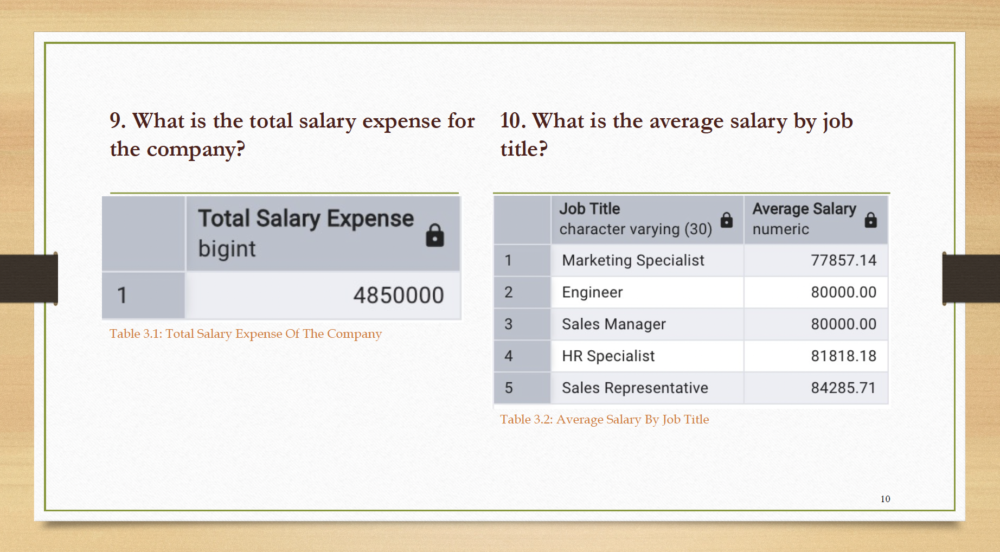

# Behavioral & Retention Analytics using SQL (NextGen Corp)

SQL-driven analysis of employee retention, performance, and remuneration patterns to identify turnover risks, performance gaps, and compensation fairness issues.

## Project Overview

This project analyzes HR data from **NextGen Corp.**, a technology company experiencing concerns around employee turnover, inconsistent performance, and salary disparities across departments. The analysis was designed to answer business-critical questions using SQL and present findings in a stakeholder-friendly format.

## Business Objectives

The project focused on three key goals:

1. **Employee Retention Analysis**

   * Identify turnover trends across departments
   * Understand root causes of employee exits
   * Detect employees at risk of leaving based on performance patterns

2. **Performance Analysis**

   * Evaluate employee performance across departments
   * Identify high- and low-performing groups
   * Highlight areas requiring management intervention

3. **Compensation Analysis**

   * Examine salary distribution by department and job title
   * Assess whether compensation aligns with performance
   * Recommend fairer salary benchmarks and policy improvements

## Tools Used

* **SQL** – data querying and analysis
* **PowerPoint** – presentation of business insights and recommendations
* **Database file** – source data storage

## Key Business Questions Answered

* Who are the top 5 longest-serving employees?
* What is the turnover rate by department?
* Which employees may be at risk of leaving based on performance?
* What are the main reasons employees leave the company?
* How many employees have left the company overall and by department?
* Which departments have the highest share of top and low performers?
* What is the average performance score by department?
* What is the company’s total salary expense?
* What is the average salary by job title?
* How many employees earn above 80,000 by department and job title?
* How does salary relate to performance across departments?

## Key Insights

### Key Insights (Preview)

#### Turnover Analysis


#### Performance Distribution


#### Salary Analysis


### 1. Employee Retention

* About **20% of employees stayed one year or less**, showing significant early turnover.
* **Marketing** and **Engineering** had the highest turnover rates at **93%** and **67%** respectively.
* The top reasons employees left were **Personal Reasons** and **Found Another Job**, suggesting deeper dissatisfaction drivers behind exits.

### 2. Performance

* **28 employees** had left the company, with **Engineering** and **Marketing** recording the highest exits.
* Only **9 employees** achieved the highest performance score of **5.0**, while **45 employees** had performance scores below **3.5**.
* Marketing had both the highest number of top performers and the highest number of low performers, suggesting inconsistent team performance.

### 3. Compensation

* Total salary expense was **4,850,000**.
* Salary distribution varied significantly by job title and department.
* The analysis found **weak alignment between salary and performance**, especially in Engineering and Marketing.
* Employees with strong performance did not consistently receive higher compensation, indicating possible fairness issues.

## Recommendations

* Introduce a **fair performance-to-pay structure** across departments.
* Use automated performance tracking to reduce bias in salary adjustments.
* Review compensation parity across equivalent roles in different departments.
* Focus retention and performance improvement efforts on **Engineering** and **Marketing**.

## Repository Structure

```text
nextgen-employee-success-analytics/
│
├── README.md
├── sql/
│   └── queries.sql
├── outputs/
│   ├── outputs.pdf
│   └── sql_analysis-output
├── presentation/
│   ├── nextgen_hr_analytics_presentation.pptx
│   └── presentation.pdf
└── images/
    ├── performance_distribution.png
    ├── salary_analysis.png
    ├── salary.png
    ├── turnover_analysis.png
    └── turover_rate.png
```

## Outcome

This project:

* solve business problems with SQL,
* translate raw data into strategic recommendations,
* communicate technical findings clearly,
* and connect analytics work to retention, performance, and organizational decision-making.

## Summary

- Identified high-turnover departments (Marketing, Engineering)
- Detected weak alignment between salary and performance
- Provided data-driven recommendations to improve retention and compensation fairness

## Author

**Hamzat Afe Isede**
Data Analyst / Data Scientist
